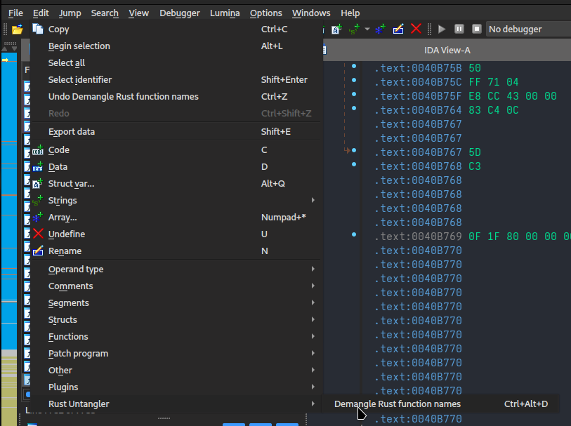

# IDA Rust Untangler

## Usage

Use the plugin by clicking _Edit > Rust Untangler > Demangle Rust function names_ in IDA's menu, or by pressing `Ctrl+Alt+D`.



Before:


After:


## Installation

1. Install the Python dependencies from this repository's [`requirements.txt`](requirements.txt).

In the Python environment used by IDA, run
```
pip install -r requirements.txt
```

2. Copy [`ida_rust_untangler.py`](ida_rust_untangler.py) into your IDA plugins directory.

The exact location of the IDA plugins directory will vary by operating system, as well as the location of your IDA user directory (`$IDAUSR`). By default, they are in the following locations:

Windows:

```
%APPDATA%/Hex-Rays/IDA Pro/plugins/
```

MacOS / Linux:

```
$HOME/.idapro/plugins/
```

Alternatively, you can find the location of the IDA plugins directory on your system by running the following snippet of Python code in IDA's Python console:

```python
import idaapi, os; print(os.path.join(idaapi.get_user_idadir(), "plugins"))
```